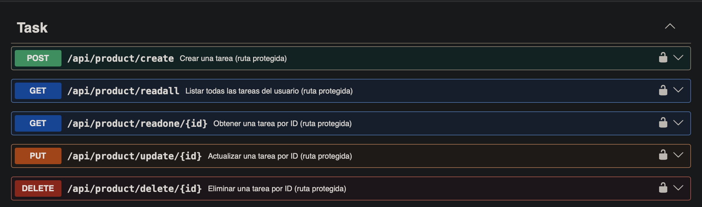
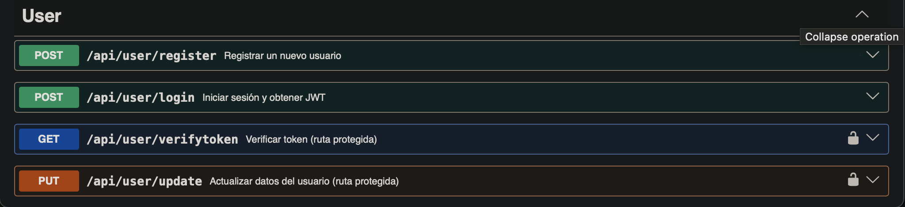
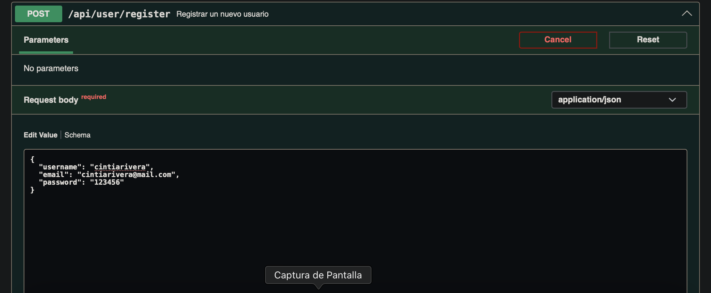
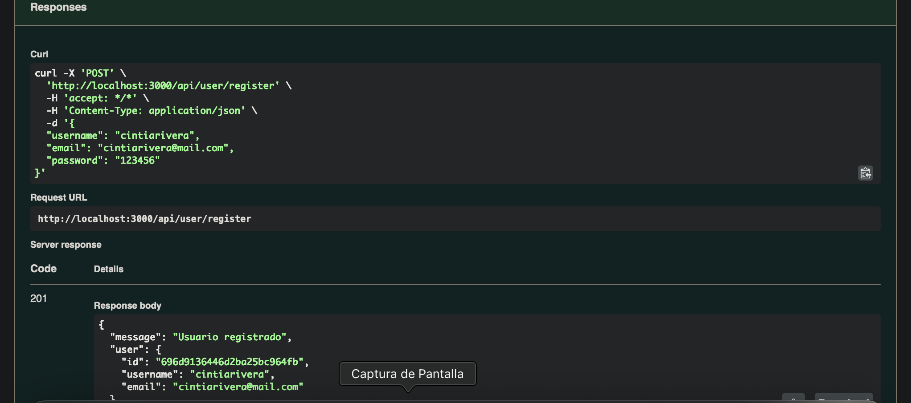
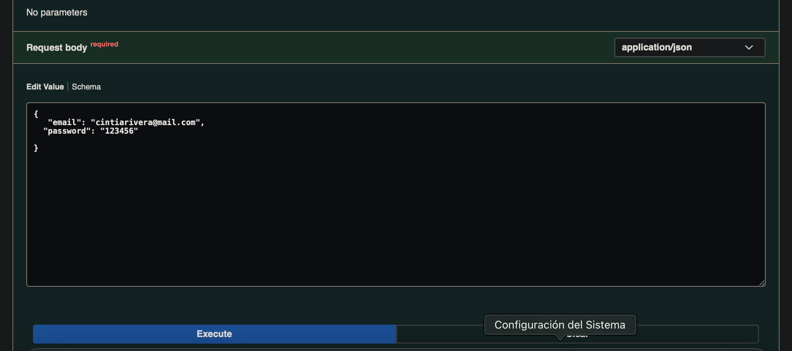
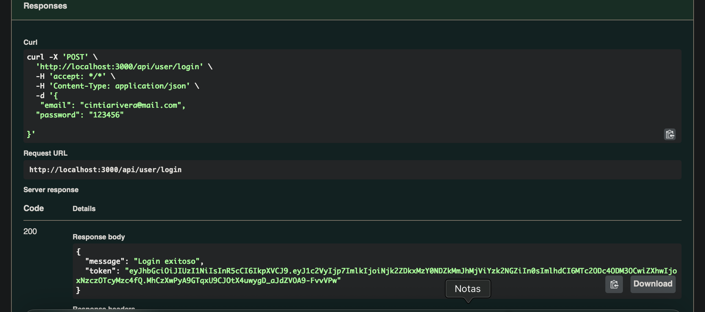
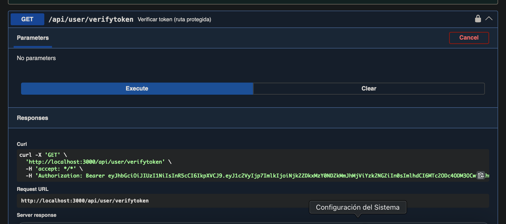

# Proyecto 6 – Backend con Autenticación JWT y MongoDB (Users + Tasks)

Este proyecto consiste en una API REST desarrollada con Node.js, Express y MongoDB que permite la gestión de usuarios y tareas mediante autenticación segura con JSON Web Tokens (JWT).

La aplicación implementa registro e inicio de sesión de usuarios, protección de rutas privadas mediante middleware de autorización y un CRUD completo de tareas asociadas a cada usuario autenticado.

Además, la API cuenta con documentación interactiva utilizando Swagger (OpenAPI), lo que permite probar los endpoints directamente desde el navegador y facilita su comprensión y uso por parte de otros desarrolladores.

El proyecto fue desarrollado siguiendo una arquitectura modular basada en controladores, modelos y rutas, aplicando buenas prácticas de seguridad como el cifrado de contraseñas con bcrypt, validación de datos y manejo de variables de entorno mediante dotenv.

---

## Demo

- API (local): http://localhost:3000  
- Healthcheck: http://localhost:3000/health  
- Swagger UI: http://localhost:3000/api-docs  

Nota: Este proyecto se ejecuta en local utilizando MongoDB local.

---

## Documentación (Swagger)

La documentación interactiva está disponible en:

http://localhost:3000/api-docs

Desde Swagger puedes:

- Visualizar los endpoints disponibles  
- Probar requests con body  
- Autorizar requests privadas usando JWT  

---

## Tecnologías utilizadas

- Node.js
- Express
- MongoDB
- Mongoose
- JSON Web Tokens (JWT)
- bcryptjs
- dotenv
- cors
- Swagger (swagger-ui-express, swagger-jsdoc)
- Nodemon

---

## Características principales

- Registro de usuarios con contraseña encriptada
- Login y generación de token JWT con expiración
- Middleware de autenticación (Bearer Token)
- Endpoint para verificar token
- Actualización de perfil de usuario protegida
- CRUD completo de tareas por usuario
- Seguridad adicional:
  - Validación de email duplicado
  - Actualización de tareas con whitelist de campos permitidos
- Swagger UI funcional

---

## Instalación local

1) Clonar repositorio

git clone <URL_DEL_REPOSITORIO>  
cd Proyecto6Mongo  

2) Instalar dependencias

npm install  

3) Crear archivo .env

PORT=3000  
MONGO_URI=mongodb://127.0.0.1:27017/proyecto6mongo  
JWT_SECRET=NuevoSecretoSuperSeguro2026_Cintia  
JWT_EXPIRES_IN=60d  

4) Ejecutar servidor

npm run dev

---

## Scripts disponibles

npm run dev  
npm start

---

## Autenticación (JWT)

La API utiliza JWT Bearer Token para proteger las rutas privadas.

Header requerido:

Authorization: Bearer <token>

Uso en Swagger:

1. Ejecutar POST /api/user/login  
2. Copiar el token  
3. Clic en Authorize  
4. Pegar solo el token  
5. Probar endpoints protegidos  

---

## Endpoints disponibles

### Usuarios (/api/user)

| Método | Endpoint     | Protegido | Descripción       |
|--------|--------------|-----------|-------------------|
| POST   | /register    | No        | Registrar usuario |
| POST   | /login       | No        | Login             |
| GET    | /verifytoken | Sí        | Verificar token   |
| PUT    | /update      | Sí        | Actualizar usuario|

---

### Tareas (/api/product)

Nota: por requerimiento del proyecto se utiliza /product, aunque el recurso corresponde a tareas.

| Método | Endpoint       | Protegido | Descripción       |
|--------|----------------|-----------|-------------------|
| POST   | /create        | Sí        | Crear tarea       |
| GET    | /readall       | Sí        | Listar tareas     |
| GET    | /readone/:id   | Sí        | Obtener tarea     |
| PUT    | /update/:id    | Sí        | Actualizar tarea  |
| DELETE | /delete/:id    | Sí        | Eliminar tarea    |

---

## Estructura del proyecto
```
Proyecto6Mongo/
├── .env
├── .gitignore
├── package.json
├── package-lock.json
├── README.md
├── assets/
│   ├── swagger-task-endpoints.png
│   ├── swagger-user-endpoints.png
│   ├── user-register-request.png
│   ├── user-register-response.png
│   ├── user-login-request.png
│   ├── user-login-response-token.png
│   ├── verify-token-request.png
│   └── verify-token-response.png
└── src/
    ├── config/
    │   ├── db.js
    │   └── swagger.js
    ├── controllers/
    │   ├── taskController.js
    │   └── userController.js
    ├── middlewares/
    │   └── authMiddleware.js
    ├── models/
    │   ├── taskModel.js
    │   └── userModel.js
    ├── routes/
    │   ├── productRoutes.js
    │   └── userRoutes.js
    └── server.js
```

## Implementación (resumen técnico)

Modelos:

User
- username
- email (único)
- password (encriptado)

Task
- title
- description
- status
- priority
- dueDate
- owner (referencia a User)

Seguridad:

- bcrypt para passwords
- JWT con expiración
- Middleware de autorización
- Acceso a tareas restringido por usuario propietario

---

## Capturas del proyecto

### Endpoints de tareas (Swagger)


### Endpoints de usuario (Swagger)


### Registro de usuario (request)


### Registro de usuario (response)


### Login (request)


### Login (token generado)


### Verify token (request)


### Verify token (response)


---

## Autora

Cintia Rivera  
Bootcamp Desarrollo Web Full Stack – 2026
